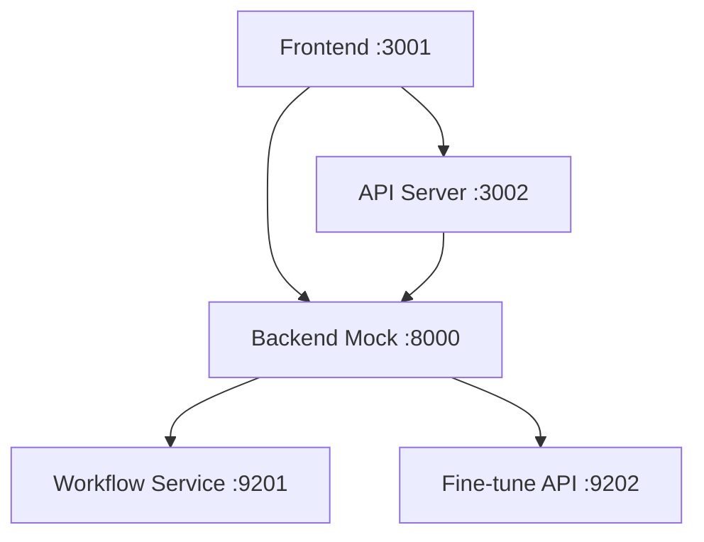

# KutiraAI Port Configuration Guide

## Overview
KutiraAI runs multiple services on a development server. This document outlines the port allocation strategy to avoid conflicts with other development services.

## Default Port Assignments

| Service | Port | Process | Description |
|---------|------|---------|-------------|
| **Frontend (Vite)** | 3001 | `npm start` | React development server with hot-reload |
| **API Server** | 3002 | `node api-server.js` | MCP Backend API for frontend integration |
| **Mock Backend** | 8000 | `node backend-mock.js` | Main mock API server |
| **Agentic Workflow** | 9201 | ↳ (spawned by backend-mock) | Workflow orchestration service |
| **Fine-tune API** | 9202 | ↳ (spawned by backend-mock) | Model fine-tuning service |

## Smart Port Management

### Automatic Port Detection
The `start-all-services.sh` script includes intelligent port management:

1. **Port Conflict Detection**: Checks if default ports are in use
2. **Process Management**: Offers to kill existing processes or find alternative ports
3. **Dynamic Configuration**: Generates `.env.local` with actual ports being used
4. **Fallback Ports**: Automatically finds next available port if default is taken

### Port Ranges
To avoid conflicts with common development services:

- **3000-3099**: Frontend services (Vite, webpack-dev-server, etc.)
- **3100-3199**: Alternative frontend ports
- **8000-8099**: Backend API services
- **9000-9299**: Specialized services (workflows, fine-tuning, etc.)

## Quick Start Commands

### Start All Services
```bash
./start-all-services.sh
```
This will:
- Check all required ports
- Handle conflicts intelligently
- Start all services in correct order
- Generate port configuration file
- Display service URLs

### Stop All Services
```bash
./stop-all-services.sh
```

### Manual Service Start
```bash
# Frontend only
npm start

# API server only
node api-server.js

# Backend mock (includes sub-services)
node backend-mock.js
```

## Environment Variables

The application respects these environment variables:

```env
# Frontend configuration
VITE_FRONTEND_PORT=3001
VITE_API_URL=http://localhost:3002
VITE_BACKEND_URL=http://localhost:8000

# API configuration
API_PORT=3002
BACKEND_PORT=8000

# Service ports (handled by backend-mock)
WORKFLOW_PORT=9201
FINETUNE_PORT=9202
```

## Troubleshooting

### Port Already in Use
```bash
# Find process using port
lsof -i:3001

# Kill process on specific port
kill -9 $(lsof -ti:3001)

# Kill all KutiraAI services
./stop-all-services.sh
```

### Check Service Health
```bash
# Frontend
curl http://localhost:3001

# API Server
curl http://localhost:3002/api/health

# Backend Mock
curl http://localhost:8000/api/health

# Workflow Service
curl http://localhost:9201/health
```

### Port Forwarding (Remote Access)
If accessing from another machine:

```bash
# SSH tunnel for all services
ssh -L 3001:localhost:3001 \
    -L 3002:localhost:3002 \
    -L 8000:localhost:8000 \
    -L 9201:localhost:9201 \
    -L 9202:localhost:9202 \
    user@dev-server
```

## Development Tips

### Running on Different Ports
```bash
# Frontend on custom port
PORT=3005 npm start

# API on custom port
PORT=3006 node api-server.js

# Update .env accordingly
```

### Using PM2 for Process Management
```bash
# Install PM2
npm install -g pm2

# Start with PM2
pm2 start ecosystem.config.js

# Monitor
pm2 monit

# Stop all
pm2 stop all
```

### Docker Alternative
For complete isolation:
```bash
# Use Docker Compose
docker-compose up

# Services will be exposed on host ports
# as defined in docker-compose.yml
```

## Service Dependencies



## Best Practices

1. **Always use the start script** for development to ensure proper port management
2. **Check `.env.local`** after starting to see actual ports in use
3. **Monitor logs** in `./logs` directory for debugging
4. **Use stop script** to cleanly shutdown all services
5. **Document port changes** if you modify default assignments

## Integration with Other Tools

### VS Code
Add to `.vscode/launch.json`:
```json
{
  "configurations": [
    {
      "type": "chrome",
      "request": "launch",
      "name": "KutiraAI Debug",
      "url": "http://localhost:3001",
      "webRoot": "${workspaceFolder}/src"
    }
  ]
}
```

### Postman/Insomnia
Import the collection from `./api-collection.json` which includes all service endpoints with correct ports.

### CI/CD
The application reads from environment variables, making it easy to deploy with different port configurations per environment.