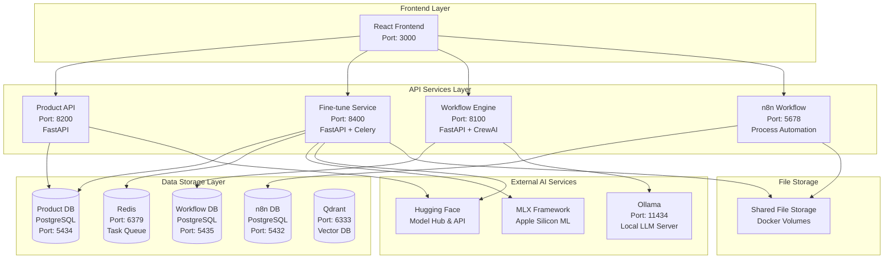

# 🚀 AI Fine-tuning & Workflow Platform

> **Enterprise-grade AI platform for local deployment with privacy-first architecture**

A comprehensive, open-source platform that enables developers and enterprises to fine-tune large language models locally, create intelligent workflows, and deploy AI solutions without compromising data privacy.

## 🌟 Key Features

- **🔒 Privacy-First**: Complete local deployment - your data never leaves your infrastructure
- **⚡ Apple Silicon Optimized**: Native MLX integration for blazing-fast performance on Apple Silicon
- **🎯 Advanced Fine-tuning**: Support for LLaMA, Mistral, and custom models with intelligent optimization
- **🔄 Intelligent Workflows**: CrewAI-based multi-agent orchestration with n8n process automation
- **📊 Real-time Monitoring**: Comprehensive progress tracking and performance metrics
- **🚀 Fast Downloads**: Integrated hf_transfer for 3-5x faster model downloads
- **🔧 Production Ready**: Microservices architecture with Docker containerization

---

## 📋 Table of Contents

- [🏠 Project Overview](#-project-overview)
- [🚀 Quick Start Guide](#-quick-start-guide)
- [🏗️ System Architecture](#️-system-architecture)
- [🔧 Installation & Setup](#-installation--setup)
- [📚 Core Components](#-core-components)
- [🎯 User Guides](#-user-guides)
- [🔌 API Documentation](#-api-documentation)
- [🛠️ Developer Guide](#️-developer-guide)
- [🔒 Security & Privacy](#-security--privacy)
- [⚡ Performance & Optimization](#-performance--optimization)
- [🔧 Configuration Reference](#-configuration-reference)
- [📊 Monitoring & Observability](#-monitoring--observability)
- [🚨 Troubleshooting](#-troubleshooting)
- [🔄 Migration & Upgrades](#-migration--upgrades)
- [🤝 Community & Support](#-community--support)
- [📄 Appendices](#-appendices)

---

## 🏠 Project Overview

### What is this platform?

This platform is a comprehensive AI solution designed for developers and enterprises who need to:
- Fine-tune large language models on their own data
- Create intelligent workflows and automation
- Deploy AI solutions locally without data privacy concerns
- Leverage Apple Silicon hardware for optimal performance

### Key Capabilities

- **Local LLM Fine-tuning**: Train models on your proprietary data
- **Workflow Automation**: Create complex AI-powered workflows
- **Model Management**: Deploy and manage multiple AI models
- **Data Processing**: Handle various data formats and sources
- **Real-time Monitoring**: Track training progress and system performance

### Architecture Philosophy

- **Private Data**: All processing happens locally - no data leaves your environment
- **Local LLMs**: Run and fine-tune models entirely on your hardware
- **End-to-end AI**: Complete pipeline from data ingestion to model deployment
- **Apple Silicon First**: Optimized for M1/M2/M3 chips with MLX framework

### Target Audience

- **Developers**: Building AI-powered applications with custom models
- **Enterprises**: Organizations requiring data privacy and local AI deployment
- **Researchers**: Teams needing flexible fine-tuning and experimentation platforms
- **Data Scientists**: Professionals working with proprietary datasets

---

## 🚀 Quick Start Guide

### Prerequisites

- **Hardware**: Apple Silicon Mac (M1/M2/M3) recommended for optimal performance
- **Software**:
  - [Ollama](https://ollama.ai/download)
  - [Docker Desktop](https://www.docker.com/products/docker-desktop/)
  - [Miniconda](https://docs.conda.io/projects/conda/en/latest/user-guide/install/macos.html)
  - [Node.js and npm](https://nodejs.org/en/download/package-manager)
- **Memory**: 16GB RAM minimum, 32GB+ recommended for large models
- **Storage**: 50GB+ free space for models and data

### Installation

```bash
# Clone the repository
git clone https://github.com/daniel-manickam/product-platform_0.0.1.git
cd product-platform_0.0.1

# Configure environment
cp .env.example .env
# Edit .env file with your configuration
# Required: Set HUGGINGFACE_API_TOKEN and database passwords

# Start all services
./start.sh

# Access the platform
open http://localhost:3000
```

### First Fine-tuning Job

1. **Upload Dataset**: Navigate to the fine-tuning section and upload your JSONL dataset
2. **Select Model**: Choose from pre-configured models or specify a custom one
3. **Configure Training**: Set parameters like learning rate, batch size, and iterations
4. **Monitor Progress**: Watch real-time training metrics and progress
5. **Deploy Model**: Use the fine-tuned model in workflows or via API

### Management Commands

- **Check Status**: `./status.sh`
- **Stop Fine-tuning**: `./stop_fine_tune.sh`
- **Stop All Services**: `docker compose down`

---

## 🏗️ System Architecture

### High-Level Architecture



### Service Architecture

#### **Frontend Layer**
- **Technology**: React 18 + Vite + Material-UI
- **Port**: 3000
- **Features**: Fine-tuning UI, dataset management, workflow builder, real-time monitoring

#### **API Services Layer**

**1. Product API (Port: 8200)**
- **Technology**: FastAPI + SQLAlchemy + PostgreSQL
- **Purpose**: Core platform data management
- **Features**: Dataset CRUD, fine-tuning configs, model metadata, HuggingFace proxy

**2. Fine-tune Service (Port: 8400)**
- **Technology**: FastAPI + Celery + Redis + MLX
- **Purpose**: AI model fine-tuning pipeline
- **Features**: MLX fine-tuning, async processing, progress tracking, Ollama integration

**3. Workflow Engine (Port: 8100)**
- **Technology**: FastAPI + CrewAI + LangChain
- **Purpose**: Agentic AI workflow orchestration
- **Features**: Multi-agent teams, dynamic workflows, LLM integration, WebSocket updates

**4. n8n Workflow (Port: 5678)**
- **Technology**: n8n + Node.js
- **Purpose**: Process automation and integration
- **Features**: Visual workflow builder, 200+ integrations, data processing pipelines

### Technology Stack

#### **Backend Technologies**
- **Python 3.12**: Core backend language
- **FastAPI**: High-performance API framework
- **SQLAlchemy**: Database ORM
- **Celery**: Distributed task queue
- **CrewAI**: Multi-agent AI framework
- **MLX**: Apple Silicon ML framework

#### **Frontend Technologies**
- **React 18**: Modern UI framework
- **Vite**: Fast build tool
- **Material-UI**: Component library
- **WebSocket**: Real-time communication

#### **Infrastructure**
- **Docker**: Containerization
- **PostgreSQL**: Primary database
- **Redis**: Caching and task queue
- **Qdrant**: Vector database
- **Ollama**: Local LLM server

#### **AI/ML Stack**
- **Ollama**: Local LLM server
- **Hugging Face**: Model hub and API
- **MLX**: Apple Silicon optimization
- **LangChain**: LLM application framework
- **LoRA**: Efficient fine-tuning technique

### 🔌 Port Configuration

| Service | Port | Protocol | Purpose |
|---------|------|----------|---------|
| Frontend | 3000 | HTTP | React development server |
| Product API | 8200 | HTTP | Core API services |
| Fine-tune Service | 8400 | HTTP | Fine-tuning operations |
| Workflow Engine | 8100 | HTTP/WS | Agent workflows |
| n8n | 5678 | HTTP | Process automation |
| Ollama | 11434 | HTTP | Local LLM inference |
| Product DB | 5434 | TCP | PostgreSQL database |
| Workflow DB | 5435 | TCP | PostgreSQL database |
| n8n DB | 5432 | TCP | PostgreSQL database |
| Redis | 6379 | TCP | Task queue |
| Qdrant | 6333 | HTTP | Vector database |

### Data Flow Architecture

#### **Fine-tuning Pipeline**
```
Dataset Upload → Product API → Database Storage →
Fine-tune Service → MLX Processing → Adapter Creation →
Ollama Model Registration → UI Update
```

#### **Workflow Execution**
```
Workflow Definition → Workflow Engine → CrewAI Agents →
Ollama LLM → Task Execution → Results Storage →
Real-time Updates
```

#### **Process Automation**
```
Trigger Event → n8n Workflow → External APIs →
Data Processing → Database Update → Notification
```

---

## 🔧 Installation & Setup

### Prerequisites

- **Hardware**: Apple Silicon Mac (M1/M2/M3) recommended for optimal performance
- **Software**:
  - [Ollama](https://ollama.ai/download)
  - [Docker Desktop](https://www.docker.com/products/docker-desktop/)
  - [Miniconda](https://docs.conda.io/projects/conda/en/latest/user-guide/install/macos.html)
  - [Node.js and npm](https://nodejs.org/en/download/package-manager)
- **Memory**: 16GB RAM minimum, 32GB+ recommended for large models
- **Storage**: 50GB+ free space for models and data

### Quick Start

```bash
# Clone the repository
git clone https://github.com/daniel-manickam/product-platform_0.0.1.git
cd product-platform_0.0.1

# Configure environment
cp .env.example .env
# Edit .env file with your configuration
# Required: Set HUGGINGFACE_API_TOKEN and database passwords

# Start all services
./start.sh

# Access the platform
open http://localhost:3000
```

### Manual Setup (Alternative)

If you prefer manual setup:

1. **Start Docker Services**
   ```bash
   docker compose up -d --build
   ```

2. **Setup Fine-tuning Service** (Apple Silicon only)
   ```bash
   cd fine_tune_service
   python3 -m venv fine_tune_env
   source fine_tune_env/bin/activate
   pip install -r requirements.txt

   # Start API service
   uvicorn app.main:app --host 0.0.0.0 --port 8400

   # In another terminal, start Celery worker
   celery -A app.celery_app.celery_app worker --loglevel=INFO
   ```

### Management Commands

- **Check Status**: `./status.sh`
- **Stop Fine-tuning**: `./stop_fine_tune.sh`
- **Stop All Services**: `docker compose down`

---

## 📚 Core Components

### Fine-tuning Service

The fine-tuning service provides enterprise-grade model training capabilities with Apple Silicon optimization.

#### Key Features
- **MLX Integration**: Native Apple Silicon acceleration for 3-5x faster training
- **Model Support**: LLaMA 3.2, LLaMA 3.1, Mistral 7B, and custom models
- **Progress Tracking**: Real-time training metrics and progress monitoring
- **Error Recovery**: Robust error handling with detailed diagnostics

#### Supported Models
| Model Family | MLX Model | Size | Recommended Use |
|--------------|-----------|------|-----------------|
| LLaMA 3.2 | `mlx-community/Llama-3.2-1B-Instruct-4bit` | 1B | Fast training, testing |
| LLaMA 3.2 | `mlx-community/Llama-3.2-3B-Instruct-4bit` | 3B | Balanced performance |
| LLaMA 3.1 | `mlx-community/Llama-3.1-8B-Instruct-4bit` | 8B | High quality results |
| Mistral | `mlx-community/Mistral-7B-Instruct-v0.3-4bit` | 7B | Efficient inference |

### Workflow Engine

CrewAI-based workflow system for creating complex AI-powered automation.

#### Features
- **Multi-Agent Teams**: Multiple AI agents working together
- **Dynamic Workflows**: Runtime workflow generation and execution
- **LLM Integration**: Direct integration with Ollama models
- **Real-time Updates**: WebSocket-based progress monitoring

### n8n Process Automation

Visual workflow builder for process automation and integration.

#### Features
- **Visual Builder**: Drag-and-drop workflow creation
- **200+ Integrations**: Pre-built connectors for popular services
- **Data Processing**: ETL pipelines and data transformation
- **Scheduled Workflows**: Time-based and event-driven automation

### Model Management

Comprehensive model lifecycle management with Ollama integration.

#### Features
- **Model Registry**: Centralized model storage and versioning
- **Dynamic Loading**: On-demand model loading and unloading
- **Health Monitoring**: Model performance and availability tracking
- **Template Support**: Pre-configured model templates

#### Model Templates
```python
# LLaMA 3.2 Template
LLAMA_32_TEMPLATE = """
<|begin_of_text|><|start_header_id|>system<|end_header_id|>
{system_prompt}<|eot_id|>
<|start_header_id|>user<|end_header_id|>
{question}<|eot_id|>
<|start_header_id|>assistant<|end_header_id|>
{answer}<|eot_id|>
"""

# Mistral Template
MISTRAL_TEMPLATE = """
<s>[INST] Question: {question} [/INST] {answer}</s>
"""
```

---

## 🎯 User Guides

### Fine-tuning Guide

#### Preparing Your Dataset
1. **Format Requirements**
   ```jsonl
   {"text": "Question: What is AI? Answer: Artificial Intelligence is..."}
   {"text": "Question: How does ML work? Answer: Machine Learning works by..."}
   ```

2. **Quality Guidelines**
   - Minimum 10 examples, recommended 100+
   - Consistent formatting across examples
   - Balanced representation of use cases

#### Choosing Models
| Use Case | Recommended Model | Reasoning |
|----------|------------------|-----------|
| Quick prototyping | Llama-3.2-1B | Fast training, good for testing |
| Production deployment | Llama-3.2-3B | Balanced speed and quality |
| High-quality results | Llama-3.1-8B | Best performance, slower training |

#### Configuration Best Practices
```python
# For small datasets (< 100 examples)
{
    "batch_size": 1,
    "learning_rate": 1e-4,
    "num_iterations": 50,
    "num_layers": 8
}

# For medium datasets (100-1000 examples)
{
    "batch_size": 2,
    "learning_rate": 1e-5,
    "num_iterations": 100,
    "num_layers": 16
}
```

### Workflow Creation

#### Basic Workflow Structure
```yaml
name: "Document Analysis Workflow"
description: "Analyze documents and extract insights"

agents:
  - name: "document_analyzer"
    model: "llama3.2-finetuned"
    role: "Document analysis specialist"

tasks:
  - name: "extract_content"
    agent: "document_analyzer"
    input: "{{ document_path }}"
    output: "extracted_content"
```

### Model Deployment

#### Ollama Integration
```bash
# Deploy fine-tuned model
ollama create my-model -f Modelfile
ollama run my-model
```

#### API Access
```python
import requests

response = requests.post("http://localhost:11434/api/generate", {
    "model": "my-model",
    "prompt": "Your question here"
})
```

---

## 🔧 Development

### Development Setup

#### Prerequisites
- Python 3.12+
- Node.js 18+
- Docker Desktop
- Ollama

#### Quick Development Setup
```bash
# Clone and setup
git clone https://github.com/daniel-manickam/product-platform_0.0.1.git
cd product-platform_0.0.1

# Start databases
docker compose up -d postgres redis

# Setup Python environment
conda create -n platform python=3.12
conda activate platform
pip install -r requirements.txt

# Setup frontend
cd frontend && npm install
```

### API Documentation

#### Core API Endpoints
```
# Product API (Port: 8200)
GET    /api/v1/datasets              # List datasets
POST   /api/v1/datasets              # Create dataset
GET    /api/v1/models                # List models
POST   /api/v1/finetune/configs      # Create fine-tune config

# Fine-tune Service (Port: 8400)
POST   /finetune/start               # Start fine-tuning
GET    /finetune/status/{task_id}    # Get training status
GET    /finetune/models              # List fine-tuned models

# Workflow Engine (Port: 8100)
POST   /workflows                    # Create workflow
POST   /workflows/{id}/execute       # Execute workflow
WebSocket /ws/workflows/{id}         # Real-time updates
```

### Testing

```bash
# Backend tests
pytest tests/

# Frontend tests
cd frontend && npm test

# Integration tests
pytest integration_tests/
```

---

## 🚨 Troubleshooting

### Common Issues

#### Installation Problems
- **MLX installation fails**: Ensure Apple Silicon and macOS 12.0+
- **Docker services won't start**: Check Docker Desktop and port availability
- **Port conflicts**: Verify ports 3000, 8200, 8400, 8100, 5678, 11434 are available

#### Training Issues
- **Out of memory errors**: Reduce batch size or use smaller models
- **Model download fails**: Check internet connection and HuggingFace token
- **Training stuck**: Check logs and ensure proper dataset format

### Diagnostic Commands

```bash
# Check service status
./status.sh

# View logs
docker logs product-api
docker logs fine-tune-service

# Check ports
lsof -i :3000,:8200,:8400,:8100,:5678,:11434
```

---

## 🔒 Security & Privacy

### Privacy-First Design
- **Local Processing**: All data remains on your infrastructure
- **No External Calls**: Models and training happen entirely locally
- **Encrypted Storage**: Data at rest encryption options
- **Access Controls**: Role-based access control (RBAC)

### Security Best Practices
- Store sensitive data in environment variables
- Use HTTPS and secure network configurations
- Enable database encryption and access controls
- Regular security updates and vulnerability scanning

---

## 🤝 Contributing

We welcome contributions from the community! Please see our [Contributing Guidelines](CONTRIBUTING.md) for details.

### Development Guidelines
1. Fork the repository
2. Create a feature branch: `git checkout -b feature/amazing-feature`
3. Make your changes with proper tests
4. Commit your changes: `git commit -m 'Add amazing feature'`
5. Push to the branch: `git push origin feature/amazing-feature`
6. Open a Pull Request

---

## 📝 License

This project is licensed under the MIT License - see the [LICENSE](LICENSE) file for details.

## 🙏 Acknowledgments

- **Apple MLX Team**: For the excellent machine learning framework
- **Hugging Face**: For model hosting and transformers library
- **Ollama Team**: For local model serving capabilities
- **CrewAI**: For multi-agent workflow capabilities
- **Open Source Community**: For various dependencies and tools

---

*Built with ❤️ for the AI community*

