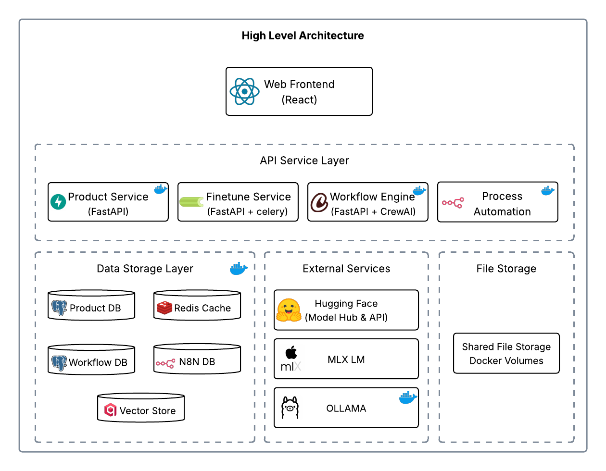

# OnPremAI


> **Enterprise-grade AI platform for complete local deployment with privacy-first architecture**

OnPremAI is your powerful, open-source sidekick for all things AI—right on your turf! From building datasets and tuning language models to connecting every part of your business, you’re in full control. Keep your data private, your workflows seamless, and bring enterprise AI to life—on your terms, every step of the way.

---

## 🌟 Introduction

OnPremAI was designed with a core philosophy: **your data should never leave your infrastructure**. In an era where data privacy and security are paramount, OnPremAI provides a complete AI platform that runs entirely on your local infrastructure.

### Key Principles

- **🔒 Complete Local Deployment**: Every component runs on your infrastructure - minimal external dependencies (only HuggingFace API for model downloads)
- **📊 End-to-End AI Pipeline**: From raw documents to fine-tuned models to enterprise workflows
- **🚀 Easy Installation**: Single command deployment with containerized, modular architecture
- **🔧 Modular Design**: Each service is independently deployable and scalable
- **🏢 Production Foundation**: Microservices architecture with health monitoring, real-time dashboards, and security-conscious design

### What Makes OnPremAI Different

- **Dataset Generation**: Automatically generate training datasets from your documents (Google Drive, local files)
- **Local Fine-tuning**: Train LLMs on your proprietary data using Apple Silicon optimization (MLX)
- **Agentic Workflows**: Create intelligent multi-agent workflows powered by CrewAI
- **Process Integration**: Seamlessly integrate AI into enterprise processes with n8n workflows
- **Vector Store**: Integrated Qdrant vector database for RAG and semantic search

---

## 🏗️ Architecture

### High-Level Architecture



### Service Architecture

#### **Frontend Layer**
- **Technology**: React 18 + Vite + Material-UI
- **Port**: 3000
- **Features**: Fine-tuning UI, dataset management, agentic workflow configuration, real-time dashboard monitoring

#### **API Services Layer**

**1. Product API (Port: 8200)**
- **Technology**: FastAPI + SQLAlchemy + PostgreSQL
- **Purpose**: Core platform data management
- **Features**: Dataset CRUD, fine-tuning configs, model metadata, HuggingFace proxy

**2. Fine-tune Service (Port: 8400)**
- **Technology**: FastAPI + Celery + Redis + MLX
- **Purpose**: AI model fine-tuning pipeline
- **Features**: MLX fine-tuning, async processing, progress tracking, Ollama integration

**3. Workflow Engine (Port: 8100)**
- **Technology**: FastAPI + CrewAI + LangChain
- **Purpose**: Agentic AI workflow orchestration
- **Features**: Multi-agent teams, dynamic workflows, LLM integration, WebSocket updates

**4. n8n Workflow (Port: 5678)**
- **Technology**: n8n + Node.js
- **Purpose**: Process automation and integration
- **Features**: Visual workflow builder, 200+ integrations, data processing pipelines

#### **Data Storage Layer**
- **Product Database**: PostgreSQL (Port: 5434) - Core platform data
- **Workflow Database**: PostgreSQL (Port: 5435) - Agent workflow data
- **n8n Database**: PostgreSQL (Port: 5432) - Process automation data
- **Redis**: (Port: 6379) - Task queue and caching
- **Qdrant**: (Port: 6333) - Vector database for embeddings

#### **AI/ML Services**
- **Ollama**: (Port: 11434) - Local LLM server
- **MLX Framework**: Apple Silicon ML optimization
- **Hugging Face Integration**: Model hub access
- **CrewAI**: Multi-agent workflow orchestration
- **n8n LangChain Nodes**: LLM integration and RAG workflows (via n8n)

### Port Configuration

| Service | Port | Protocol | Purpose |
|---------|------|----------|---------|
| Frontend | 3000 | HTTP | React development server |
| Product API | 8200 | HTTP | Core API services |
| Fine-tune Service | 8400 | HTTP | Fine-tuning operations |
| Workflow Engine | 8100 | HTTP/WS | Agent workflows |
| n8n | 5678 | HTTP | Process automation |
| Ollama | 11434 | HTTP | Local LLM inference |
| Product DB | 5434 | TCP | PostgreSQL database |
| Workflow DB | 5435 | TCP | PostgreSQL database |
| n8n DB | 5432 | TCP | PostgreSQL database |
| Redis | 6379 | TCP | Task queue |
| Qdrant | 6333 | HTTP | Vector database |

---

## 🚀 Quick Start Guide

### Prerequisites

- **Hardware**: Apple Silicon Mac (M1/M2/M3) recommended for MLX fine-tuning optimization
- **Software**:
  - [Python 3.12+](https://www.python.org/downloads/) - Required for backend services
  - [Ollama](https://ollama.ai/download) - Required for local LLM serving
  - [Docker Desktop](https://www.docker.com/products/docker-desktop/) - Required for containerized services
  - [Miniconda](https://docs.conda.io/projects/conda/en/latest/user-guide/install/macos.html) - Required for fine-tuning service
  - [Node.js and npm](https://nodejs.org/en/download/package-manager) - Required for frontend development
  - [DBeaver](https://dbeaver.io/download/) or similar database client - Optional for database inspection
- **HuggingFace Account**:
  - [HuggingFace API Token](https://huggingface.co/settings/tokens) with access to models you plan to fine-tune
  - Ensure token has access to gated models if using restricted models
- **Network**: Internet connection required for initial model downloads from HuggingFace

### Installation

#### One-Command Setup

```bash
# Clone the repository
git clone https://github.com/daniel-manickam/OnPremAI.git
cd OnPremAI

# Configure environment
cp .env.example .env
# Edit .env file with your configuration
# Required: Set HUGGINGFACE_API_TOKEN for model downloads and image generation
# Optional: Customize database passwords and other settings

# Start the entire platform
./start.sh
```

The `start.sh` script will:
- Start all Docker services (databases, APIs, frontend)
- Set up the fine-tuning service with MLX
- Import pre-built n8n workflows
- Install HuggingFace Hub library with optimized download capabilities for faster model downloads
- Verify all services are running
- Provide access URLs

#### N8N Credentials Setup

After the platform is running, you need to create the following credentials in n8n (http://localhost:5678):

1. **Google Drive OAuth2 account** - For document access from Google Drive
   - Follow setup guide: https://docs.n8n.io/integrations/builtin/credentials/google/
2. **PostgreSQL account** - For database integration
   - Host: `host.docker.internal`
   - Port: `5434` (Product DB) or `5435` (Workflow DB)
3. **Qdrant API account** - For vector database operations
   - Qdrant URL: `http://host.docker.internal:6333`
   - API Key: Not required (leave empty)
4. **Ollama account** - For local LLM integration
   - Base URL: `http://host.docker.internal:11434`

**Important**: After creating these credentials, you must go to each of the 6 pre-built workflows and reselect the appropriate credentials in their respective nodes for the workflows to function properly.

#### Pre-built Workflows

OnPremAI includes 6 pre-configured n8n workflows:

| Workflow Name | Purpose | Description |
|---------------|---------|-------------|
| **Dataset Generator - Google Drive** | Document Processing | Extracts documents from Google Drive, chunks them, and generates Q&A pairs for fine-tuning |
| **Dataset Generator - Local Drive** | Document Processing | Processes local documents and creates training datasets with Q&A generation |
| **Dataset Generator Sub Process** | Data Processing | Reusable subprocess for document chunking and Q&A generation logic |
| **Agentic Workflow** | AI Orchestration | Executes CrewAI-based multi-agent workflows via HTTP integration |
| **RAG Workflow** | Knowledge Retrieval | Implements Retrieval-Augmented Generation with Qdrant vector search |
| **Update Knowledge Base** | Vector Store Management | Updates and manages Qdrant vector embeddings with document processing |

---

## 🎯 Key Capabilities

### 4.1 Dataset Generation

OnPremAI provides comprehensive dataset generation capabilities for fine-tuning:

- **Multi-Source Support**: Read documents from Google Drive or local file systems via n8n workflows
- **Intelligent Chunking**: Automatically split documents into optimal chunks for training
- **Q&A Generation**: Generate question-answer pairs from document chunks using LLMs
- **Format Optimization**: Format datasets specifically for target LLM architectures (LLaMA, Mistral, etc.)
- **Quality Control**: Review and edit generated Q&A pairs before training
- **Batch Processing**: Handle large document collections efficiently

**Supported Formats**: PDF, TXT
**Output Formats**: JSONL optimized for LLaMA 3.2, Mistral, and custom model templates

### 4.2 Fine-tuning LLM

Enterprise-grade model fine-tuning with Apple Silicon optimization:

- **MLX Integration**: Native Apple Silicon acceleration for 3-5x faster training
- **Model Support**: MLX-community models (e.g., mlx-community/Llama-3.2-3B-Instruct-4bit, mlx-community/Mistral-7B-Instruct-v0.3-4bit)
- **LoRA Fine-tuning**: Efficient parameter-efficient training
- **Progress Monitoring**: Track training progress in real-time, monitor loss curves through logs
- **Automatic Deployment**: Deploy fine-tuned models directly to Ollama
- **LoRA Adapters**: Generate and save LoRA adapters during fine-tuning process

**Process Flow**:
1. Upload dataset (JSONL format)
2. Select base model and configure parameters
3. Start training with real-time progress tracking
4. Automatic model deployment to Ollama
5. Test and validate fine-tuned model

### 4.3 Agentic Workflows

Powered by CrewAI for intelligent multi-agent orchestration:

- **Agent Configuration**: Define specialized AI agents with specific roles and capabilities
- **Team Coordination**: Orchestrate multiple agents working together on complex tasks
- **Dynamic Workflows**: Create workflows that adapt based on intermediate results
- **LLM Integration**: Use your fine-tuned models within agent workflows
- **API Integration**: Invoke agentic workflows via REST API
- **n8n Integration**: Seamlessly integrate with enterprise processes using HTTP nodes

**Example Use Cases**:
- Document analysis and summarization teams
- Multi-step research and fact-checking workflows
- Content generation with review and editing agents
- Data processing and validation pipelines

### 4.4 Process Flows

Powered by n8n for enterprise process automation:

- **Visual Workflow Builder**: Drag-and-drop interface for creating complex processes
- **200+ Integrations**: Pre-built connectors for popular enterprise systems
- **Fine-tuned LLM Integration**: Use your custom models within process flows
- **Agentic Workflow Invocation**: Call CrewAI workflows from n8n processes
- **Event-driven Automation**: Trigger workflows based on external events
- **Data Transformation**: ETL capabilities for data processing

**Integration Capabilities**:
- CRM systems (Salesforce, HubSpot)
- Communication platforms (Slack, Teams, Email)
- File storage (Google Drive, SharePoint, S3)
- Databases and APIs
- Custom HTTP endpoints

### 4.5 Vector Store

Integrated Qdrant vector database for semantic search and RAG:

- **Qdrant Dashboard**: Web interface accessible at http://localhost:6333/dashboard
- **Embedding Management**: Store and query document embeddings via n8n workflows
- **Semantic Search**: Find similar documents and content using vector similarity
- **RAG Implementation**: Retrieval-Augmented Generation workflows with Ollama embeddings
- **Collection Management**: Organize embeddings by project or domain (e.g., "rag_collection")
- **n8n Integration**: Direct integration with Update Knowledge Base and RAG workflows

**Current Implementation**:
- Qdrant vector store running on port 6333
- Integration with n8n workflows for embedding operations
- Uses Ollama "nomic-embed-text:latest" model for embeddings
- Pre-configured collections for RAG workflows

---

## 🏛️ Architecture Philosophy

OnPremAI is built on four core architectural principles:

- **Private Data**: All processing happens locally - minimal external dependencies (only HuggingFace for model downloads)
- **Local LLMs**: Run and fine-tune models entirely on your hardware using Ollama and MLX
- **End-to-end AI**: Complete pipeline from data ingestion to model deployment and workflow integration
- **Apple Silicon First**: Optimized for M1/M2/M3 chips with MLX framework for efficient fine-tuning

This ensures data sovereignty while providing a complete AI development and deployment platform.

---

## ⚠️ Current Limitations & Future Enhancements

### Current State
OnPremAI provides a solid foundation for local AI development with the following current limitations:

**Security & Authentication**
- No authentication system implemented (development mode)
- APIs are open without rate limiting
- No HTTPS/TLS configuration

**Monitoring & Logging**
- Basic health checks and dashboard monitoring
- No centralized logging aggregation
- No metrics collection (Prometheus/Grafana)
- No alerting system

**High Availability**
- Single instance deployment
- No load balancing or clustering
- No automated backup/disaster recovery

### Planned Enhancements
- **Authentication & Authorization**: OAuth2, RBAC, API key management
- **Enterprise Security**: HTTPS, rate limiting, audit logging
- **Advanced Monitoring**: Prometheus metrics, Grafana dashboards, alerting
- **High Availability**: Load balancing, clustering, automated backups
- **CI/CD Integration**: Automated testing, deployment pipelines
- **Model Registry**: Centralized model versioning and management

---

## 📚 API Documentation

### Core API Endpoints

#### Product API (Port: 8200)
```bash
# Dataset Management
GET    /api/v1/datasets              # List datasets
POST   /api/v1/datasets              # Create dataset
GET    /api/v1/datasets/{id}         # Get dataset details
PUT    /api/v1/datasets/{id}         # Update dataset
DELETE /api/v1/datasets/{id}         # Delete dataset

# Model Management
GET    /api/v1/models                # List models
POST   /api/v1/models                # Register model
GET    /api/v1/models/{id}           # Get model details

# Fine-tuning Configuration
POST   /api/v1/finetune/configs      # Create fine-tune config
GET    /api/v1/finetune/configs      # List configurations
GET    /api/v1/finetune/configs/{id} # Get configuration details

# Dashboard & Analytics
GET    /api/v1/dashboard/stats       # Platform statistics
GET    /api/v1/dashboard/chart-data  # Chart data for UI

# Image Generation
POST   /api/v1/image/generate        # Generate images with FLUX.1-dev
```

#### Fine-tune Service (Port: 8400)
```bash
# Fine-tuning Operations
POST   /finetune/start               # Start fine-tuning job
GET    /finetune/status/{task_id}    # Get training status
POST   /finetune/stop/{task_id}      # Stop training job
GET    /finetune/models              # List fine-tuned models
GET    /finetune/logs/{task_id}      # Get training logs

# Model Management
POST   /finetune/deploy/{model_id}   # Deploy model to Ollama
GET    /finetune/adapters            # List model adapters
DELETE /finetune/adapters/{id}       # Delete adapter
```

#### Workflow Engine (Port: 8100)
```bash
# Workflow Management
POST   /workflows                    # Create workflow
GET    /workflows                    # List workflows
GET    /workflows/{id}               # Get workflow details
PUT    /workflows/{id}               # Update workflow
DELETE /workflows/{id}               # Delete workflow

# Execution
POST   /workflows/{id}/execute       # Execute workflow
GET    /workflows/{id}/executions    # List executions
GET    /executions/{id}              # Get execution details
POST   /executions/{id}/stop         # Stop execution

# Real-time Updates
WebSocket /ws/workflows/{id}         # Real-time workflow updates
WebSocket /ws/executions/{id}        # Real-time execution updates

# Agent Management
POST   /agents                       # Create agent
GET    /agents                       # List agents
PUT    /agents/{id}                  # Update agent
DELETE /agents/{id}                  # Delete agent
```

#### n8n Workflow Service (Port: 5678)
```bash
# Standard n8n API endpoints
GET    /api/v1/workflows             # List workflows
POST   /api/v1/workflows             # Create workflow
GET    /api/v1/workflows/{id}        # Get workflow
PUT    /api/v1/workflows/{id}        # Update workflow
DELETE /api/v1/workflows/{id}        # Delete workflow

# Execution
POST   /api/v1/workflows/{id}/activate    # Activate workflow
POST   /api/v1/workflows/{id}/deactivate  # Deactivate workflow
GET    /api/v1/executions                 # List executions
GET    /api/v1/executions/{id}            # Get execution details
```

### Authentication

**Current State**: The platform currently operates without authentication for development ease. All API endpoints are accessible without authentication.

**Production Deployment**: For production use, implement authentication by:
- Adding API key middleware to FastAPI services
- Configuring n8n with user management and JWT tokens
- Setting up environment variables for API keys

### WebSocket Connections

Real-time updates are available via WebSocket connections:

```javascript
// Connect to workflow execution updates
const ws = new WebSocket('ws://localhost:8100/ws/executions/execution-id');
ws.onmessage = (event) => {
    const update = JSON.parse(event.data);
    console.log('Execution update:', update);
};
```

---

## 🤝 Contributing

Contributions from the community are welcome! Please see the [Contributing Guidelines](CONTRIBUTING.md) for details.

### Development Guidelines

1. **Fork the repository**
2. **Create a feature branch**: `git checkout -b feature/amazing-feature`
3. **Make your changes** with proper tests
4. **Commit your changes**: `git commit -m 'Add amazing feature'`
5. **Push to the branch**: `git push origin feature/amazing-feature`
6. **Open a Pull Request**

### Development Setup

```bash
# Clone and setup
git clone https://github.com/your-org/OnPremAI.git
cd OnPremAI

# Start databases only
docker compose up -d postgres-product postgres-workflow postgres-n8n redis qdrant

# Setup Python environment
conda create -n onpremai python=3.12
conda activate onpremai
pip install -r requirements.txt

# Setup frontend
cd frontend && npm install && npm run dev

# Run individual services for development
cd product_api && uvicorn app.main:app --reload --port 8200
cd workflow_engine && uvicorn src.main:app --reload --port 8100
cd fine_tune_service && uvicorn app.main:app --reload --port 8400
```

### Testing

```bash
# Backend tests
pytest tests/

# Frontend tests
cd frontend && npm test

# Integration tests
pytest integration_tests/

# End-to-end tests
pytest e2e_tests/
```

### Code Quality

- **Python**: Follow PEP 8, use Black for formatting, type hints required
- **JavaScript/React**: Follow ESLint configuration, use Prettier for formatting
- **Documentation**: Update README and API docs for any new features
- **Tests**: Maintain >80% test coverage for new code

---

## 📝 License

This project is licensed under the MIT License - see the [LICENSE](LICENSE) file for details.

---

## 🙏 Acknowledgments

OnPremAI is built on the shoulders of giants. Special thanks to the following projects and communities:

- **[Apple MLX Team](https://github.com/ml-explore/mlx)**: For the excellent machine learning framework optimized for Apple Silicon
- **[Hugging Face](https://huggingface.co/)**: For model hosting, transformers library, and democratizing AI
- **[Ollama Team](https://ollama.ai/)**: For making local model serving accessible and efficient
- **[CrewAI](https://github.com/joaomdmoura/crewAI)**: For multi-agent workflow capabilities and intelligent orchestration
- **[n8n](https://n8n.io/)**: For the powerful workflow automation platform
- **[Qdrant](https://qdrant.tech/)**: For the high-performance vector database
- **[FastAPI](https://fastapi.tiangolo.com/)**: For the modern, fast web framework
- **[React Team](https://react.dev/)**: For the excellent frontend framework
- **[Docker](https://www.docker.com/)**: For containerization technology
- **[PostgreSQL](https://www.postgresql.org/)**: For the robust database system
- **[Redis](https://redis.io/)**: For caching and task queue capabilities
- **[Material-UI](https://mui.com/)**: For the beautiful React component library
- **[Open Source Community](https://opensource.org/)**: For various dependencies, tools, and inspiration

### Special Thanks

- **Enterprise AI Community**: For feedback and real-world use case validation
- **Privacy Advocates**: For emphasizing the importance of local AI deployment
- **Apple Silicon Developers**: For pushing the boundaries of on-device AI performance
- **Contributors**: Everyone who has contributed code, documentation, bug reports, and feature requests

---

## 📞 Support & Community

- **Documentation**: This README serves as the primary documentation

---

*Built with ❤️ for the community who value data privacy and AI innovation*
